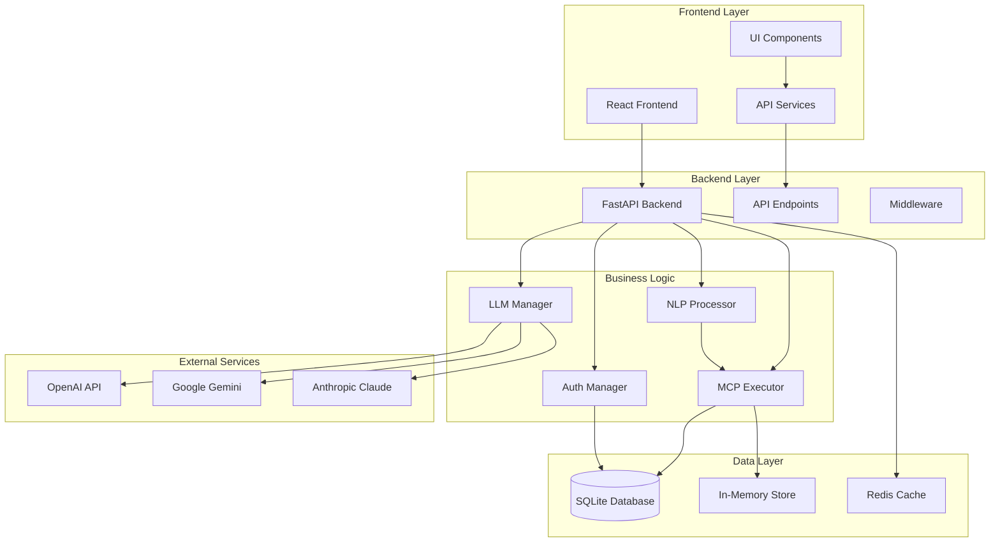

# MCP Hub - Project Overview

<div align="center">


**A comprehensive platform for managing Model Context Protocol (MCP) tools, resources, and AI interactions with multi-LLM support.**

[🚀 Quick Start](#quick-start) • [🏗️ Architecture](#architecture) • [📚 Documentation](#documentation) • [🤝 Contributing](#contributing)

</div>

## 🎯 Project Vision

MCP Hub is designed to be the central platform for managing and executing Model Context Protocol (MCP) tools across multiple AI providers. It provides a unified interface for developers and users to interact with various AI models while maintaining tool consistency and resource management.

## ✨ Key Features

### 🤖 Multi-LLM Integration
- **OpenAI GPT** models with intelligent fallback
- **Google Gemini** integration
- **Anthropic Claude** support
- Automatic provider switching on quota exceeded

### 🧠 Natural Language Processing
- Convert natural language to tool execution commands
- Pattern matching with regex for tool identification
- Parameter extraction from conversational queries
- Confidence scoring for tool suggestions

### 🛠️ Tool Management
- Execute MCP tools with parameter validation
- Support for SQLite, filesystem, and memory tools
- Error handling and result formatting
- Tool grouping by server with breadcrumb navigation

### 🔄 Real-time Communication
- WebSocket support for live updates
- Real-time chat responses
- Tool execution notifications
- System status monitoring

### 🔐 Security & Authentication
- JWT-based authentication
- Role-based access control (RBAC)
- API key management
- Input validation and sanitization

## 🏗️ Architecture

### High-Level Architecture



### Project Structure

```
mcp_hub/
├── mcp-hub-core/              # Backend API (FastAPI)
│   ├── app/
│   │   ├── api/               # API endpoints
│   │   ├── core/              # Core configuration
│   │   └── services/          # Business logic
│   ├── docs/                  # Backend documentation
│   ├── main.py                # FastAPI application
│   └── requirements.txt       # Python dependencies
├── mcp-hub-ui/                # Frontend (React)
│   ├── src/
│   │   ├── components/        # React components
│   │   ├── pages/            # Page components
│   │   └── services/         # API services
│   ├── tests/                # E2E tests (Playwright)
│   └── package.json          # Node.js dependencies
├── docs/                      # Project documentation
├── .gitignore                 # Git ignore rules
└── README.md                  # Project overview
```

## 🚀 Quick Start

### Prerequisites

- Python 3.8+
- Node.js 16+
- API keys for LLM providers (OpenAI, Google, Anthropic)

### Backend Setup

```bash
# Navigate to backend
cd mcp-hub-core

# Create virtual environment
python -m venv venv
source venv/bin/activate  # On Windows: venv\Scripts\activate

# Install dependencies
pip install -r requirements.txt

# Set up environment variables
cp env.example .env
# Edit .env with your API keys

# Initialize database
python -c "from app.core.database import init_db; init_db()"

# Run backend
uvicorn main:app --host 0.0.0.0 --port 8000 --reload
```

### Frontend Setup

```bash
# Navigate to frontend
cd mcp-hub-ui

# Install dependencies
npm install

# Set up environment variables
cp env.example .env
# Edit .env with your configuration

# Run frontend
npm start
```

### Access the Application

- **Frontend**: http://localhost:3000
- **Backend API**: http://localhost:8000
- **API Documentation**: http://localhost:8000/docs

## 📚 Documentation

### Comprehensive Guides

- **[Backend Architecture](mcp-hub-core/docs/BACKEND_ARCHITECTURE.md)** - Detailed backend architecture with diagrams
- **[API Reference](mcp-hub-core/docs/API_REFERENCE.md)** - Complete API documentation with examples
- **[Deployment Guide](mcp-hub-core/docs/DEPLOYMENT_GUIDE.md)** - Production deployment instructions
- **[Development Guide](mcp-hub-core/docs/DEVELOPMENT_GUIDE.md)** - Developer setup and contribution guidelines

### Component Documentation

- **[Frontend Components](mcp-hub-ui/README.md)** - React component documentation
- **[Backend Services](mcp-hub-core/README.md)** - Backend service documentation
- **[Database Schema](mcp-hub-core/docs/BACKEND_ARCHITECTURE.md#database-schema)** - Database structure and relationships

## 🔧 API Endpoints

### System Status
- `GET /api/status` - Get system status and health information

### Chat API
- `POST /api/chat/` - Send messages and get AI responses with NLP
- `GET /api/chat/history` - Retrieve chat history
- `DELETE /api/chat/history` - Clear chat history

### Tools API
- `GET /api/tools/` - List all available tools
- `GET /api/tools/{tool_name}` - Get specific tool details
- `POST /api/tools/{tool_name}/execute` - Execute a tool
- `GET /api/tools/servers` - List MCP servers
- `POST /api/tools/servers/{server_name}/toggle` - Toggle server status

### Resources API
- `GET /api/resources/` - List all resources
- `GET /api/resources/{resource_name}` - Get specific resource
- `POST /api/resources/` - Create new resource
- `PUT /api/resources/{resource_name}` - Update resource
- `DELETE /api/resources/{resource_name}` - Delete resource
- `GET /api/resources/servers/` - List servers
- `POST /api/resources/servers/` - Create server
- `DELETE /api/resources/servers/{server_name}` - Delete server

### Authentication API
- `POST /api/auth/login` - User authentication
- `POST /api/auth/logout` - User logout
- `GET /api/auth/profile` - Get user profile

## 💡 Usage Examples

### Chat with Natural Language Processing

```python
import requests

# Send a natural language message
response = requests.post('http://localhost:8000/api/chat/', json={
    'message': 'List all database tables',
    'provider': 'openai'
})

print(response.json())
# Output: {"response": "Found 3 tables: servers, resources, tools", "provider": "nlp-tools", ...}
```

### Execute Tools Directly

```python
# Execute a database query
response = requests.post('http://localhost:8000/api/tools/query_database/execute', json={
    'query': 'SELECT COUNT(*) FROM tools'
})

print(response.json())
# Output: {"server": "sqlite", "tool": "query_database", "result": {"columns": ["COUNT(*)"], "rows": [[10]], "row_count": 1}, "success": true}
```

### Manage Resources

```python
# Create a new resource
response = requests.post('http://localhost:8000/api/resources/', json={
    'name': 'external_api',
    'uri': 'https://api.example.com',
    'server_name': 'external-server',
    'description': 'External API resource'
})

print(response.json())
# Output: {"message": "Resource created successfully", "resource": {...}}
```

## 🧪 Development

### Backend Development

```bash
# Install development dependencies
pip install -r requirements-dev.txt

# Run tests
pytest

# Run with coverage
pytest --cov=app --cov-report=html

# Code quality checks
black app/ tests/
isort app/ tests/
flake8 app/ tests/
mypy app/
```

### Frontend Development

```bash
# Install dependencies
npm install

# Run development server
npm start

# Run tests
npm test

# Run E2E tests
npm run test:e2e

# Build for production
npm run build
```

## 🚀 Deployment

### Docker Deployment

```bash
# Backend
cd mcp-hub-core
docker build -t mcp-hub-core .
docker run -d -p 8000:8000 mcp-hub-core

# Frontend
cd mcp-hub-ui
docker build -t mcp-hub-ui .
docker run -d -p 3000:3000 mcp-hub-ui
```

### Docker Compose

```bash
# Deploy both services
docker-compose up -d
```

### Kubernetes

```bash
# Deploy to Kubernetes
kubectl apply -f k8s/
```

## 🔒 Security

### Security Features

- JWT token-based authentication
- Role-based access control (RBAC)
- API key management and rotation
- Input validation and sanitization
- SQL injection prevention
- XSS protection
- CORS configuration
- Rate limiting and request throttling

### Security Best Practices

- Environment variable configuration
- Secure headers and HTTPS
- Database security with constraints
- Audit logging and monitoring
- Regular security updates

## 📊 Performance

### Benchmarks

- **Response Time**: < 200ms for tool execution
- **Throughput**: 1000+ requests/minute
- **Memory Usage**: < 512MB base usage
- **Database**: SQLite with connection pooling

### Monitoring

- Health check endpoints
- Prometheus metrics integration
- Structured logging with different levels
- Performance monitoring and alerting

## 📈 Roadmap

### Upcoming Features

- [ ] **Advanced NLP**: Improved pattern matching and parameter extraction
- [ ] **Plugin System**: Support for custom tool plugins
- [ ] **Analytics**: Usage analytics and reporting
- [ ] **Multi-tenancy**: Support for multiple organizations
- [ ] **Advanced Caching**: Redis integration for better performance
- [ ] **Monitoring**: Advanced monitoring and alerting
- [ ] **API Versioning**: Support for API versioning
- [ ] **GraphQL**: GraphQL endpoint for flexible queries

## 🤝 Contributing

1. Fork the repository
2. Create a feature branch (`git checkout -b feature/amazing-feature`)
3. Commit your changes (`git commit -m 'Add amazing feature'`)
4. Push to the branch (`git push origin feature/amazing-feature`)
5. Open a Pull Request

### Development Guidelines

- Follow PEP 8 style guidelines for Python
- Follow ESLint rules for JavaScript/React
- Use type hints for all Python functions
- Write comprehensive docstrings
- Include unit tests for new features
- Update documentation for API changes

## 📄 License

This project is licensed under the MIT License - see the [LICENSE](LICENSE) file for details.

## 🆘 Support

For questions and support:

- 📖 **Documentation**: Check the comprehensive guides in `/docs`
- 🐛 **Issues**: Create an issue on GitHub
- 💬 **Discussions**: Join our GitHub Discussions
- 📧 **Contact**: Reach out to the development team

## 🙏 Acknowledgments

- **FastAPI** team for the excellent web framework
- **React** team for the frontend library
- **OpenAI** for GPT models and API
- **Google** for Gemini API
- **Anthropic** for Claude API
- **SQLAlchemy** for database ORM
- **Pydantic** for data validation
- **Material-UI** for React components

---

<div align="center">

**Built with ❤️ by the MCP Hub Team**

[⭐ Star us on GitHub](https://github.com/Kibrom1/mcp_hub) • [🐛 Report Issues](https://github.com/Kibrom1/mcp_hub/issues) • [💬 Join Discussions](https://github.com/Kibrom1/mcp_hub/discussions)

</div>
