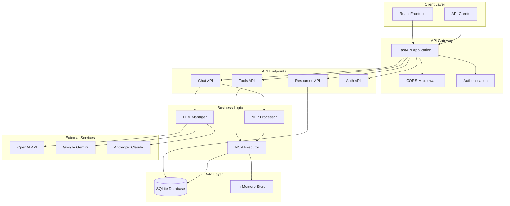
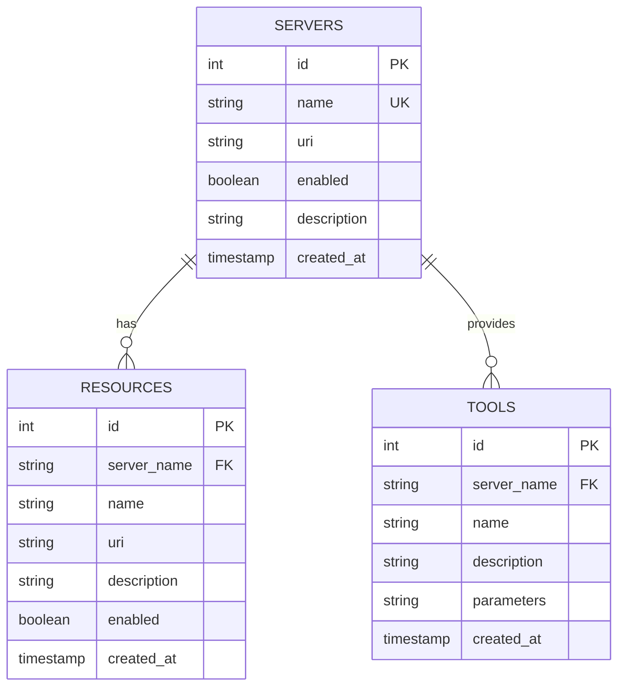

# MCP Hub Core - Backend Architecture

## Overview

MCP Hub Core is a FastAPI-based backend service that provides a comprehensive API for managing MCP (Model Context Protocol) tools, resources, and AI interactions. The backend is designed with a modular architecture that supports multiple LLM providers, natural language processing, and real-time communication.

## Architecture Diagram



## Project Structure

```
mcp-hub-core/
├── app/                          # Main application package
│   ├── __init__.py              # Package initialization
│   ├── api/                     # API endpoints
│   │   ├── __init__.py
│   │   ├── auth.py              # Authentication endpoints
│   │   ├── chat.py              # Chat and NLP endpoints
│   │   ├── resources.py         # Resource management endpoints
│   │   └── tools.py             # Tool execution endpoints
│   ├── core/                    # Core configuration
│   │   ├── __init__.py
│   │   ├── config.py            # Application configuration
│   │   └── database.py          # Database initialization
│   └── services/                # Business logic services
│       ├── llm_manager.py       # LLM provider management
│       ├── mcp_executor.py      # MCP tool execution
│       └── nlp_tool_processor.py # Natural language processing
├── main.py                      # FastAPI application entry point
├── requirements.txt             # Python dependencies
├── env.example                  # Environment variables template
└── README.md                    # Project documentation
```

## Core Components

### 1. FastAPI Application (`main.py`)

The main application file that initializes the FastAPI server with all necessary middleware and routes.

**Key Features:**
- CORS configuration for cross-origin requests
- WebSocket support for real-time communication
- Global error handling
- Startup/shutdown event handlers

**Configuration:**
```python
app = FastAPI(
    title="MCP Hub API",
    description="API for managing MCP tools, resources, and AI interactions.",
    version="0.1.0",
)
```

### 2. API Endpoints

#### Chat API (`app/api/chat.py`)
- **POST** `/api/chat/` - Send messages and get AI responses
- **GET** `/api/chat/history` - Retrieve chat history
- **DELETE** `/api/chat/history` - Clear chat history

**Features:**
- Natural language processing for tool execution
- Multi-LLM support with fallback mechanisms
- Real-time response streaming
- Tool suggestion system

#### Tools API (`app/api/tools.py`)
- **GET** `/api/tools/` - List all available tools
- **GET** `/api/tools/{tool_name}` - Get specific tool details
- **POST** `/api/tools/{tool_name}/execute` - Execute a tool
- **GET** `/api/tools/servers` - List MCP servers
- **POST** `/api/tools/servers/{server_name}/toggle` - Toggle server status

#### Resources API (`app/api/resources.py`)
- **GET** `/api/resources/` - List all resources
- **GET** `/api/resources/{resource_name}` - Get specific resource
- **POST** `/api/resources/` - Create new resource
- **PUT** `/api/resources/{resource_name}` - Update resource
- **DELETE** `/api/resources/{resource_name}` - Delete resource
- **GET** `/api/resources/servers/` - List servers
- **POST** `/api/resources/servers/` - Create server
- **DELETE** `/api/resources/servers/{server_name}` - Delete server

#### Auth API (`app/api/auth.py`)
- **POST** `/api/auth/login` - User authentication
- **POST** `/api/auth/logout` - User logout
- **GET** `/api/auth/profile` - Get user profile

### 3. Business Logic Services

#### LLM Manager (`app/services/llm_manager.py`)

Manages multiple LLM providers with intelligent fallback mechanisms.

**Supported Providers:**
- OpenAI GPT models
- Google Gemini
- Anthropic Claude

**Key Features:**
- Automatic fallback on quota exceeded
- Provider-specific configuration
- Async response generation
- Token usage tracking

**Usage Example:**
```python
llm_manager = LLMManager()
response = await llm_manager.generate_response_async(
    messages=[{"role": "user", "content": "Hello"}],
    provider="openai",
    max_tokens=1000
)
```

#### MCP Executor (`app/services/mcp_executor.py`)

Executes MCP tools and manages resources across different server types.

**Supported Server Types:**
- SQLite Database
- File System
- In-Memory Store

**Key Features:**
- Tool parameter validation
- Server-specific execution logic
- Error handling and logging
- Result formatting

**Tool Categories:**
- **Database Tools**: `query_database`, `list_tables`, `describe_table`
- **File System Tools**: `read_file`, `write_file`, `list_directory`
- **Memory Tools**: `store_memory`, `retrieve_memory`, `list_memories`

#### NLP Processor (`app/services/nlp_tool_processor.py`)

Converts natural language queries into tool execution commands.

**Features:**
- Pattern matching with regex
- Parameter extraction
- Confidence scoring
- Tool suggestion system

**Supported Patterns:**
- "List database tables" → `list_tables`
- "Show file contents of /path" → `read_file`
- "Query: SELECT * FROM users" → `query_database`

### 4. Data Layer

#### Database Schema

```sql
-- Servers table
CREATE TABLE servers (
    id INTEGER PRIMARY KEY AUTOINCREMENT,
    name TEXT NOT NULL UNIQUE,
    uri TEXT NOT NULL,
    enabled BOOLEAN NOT NULL DEFAULT 1,
    description TEXT,
    created_at TIMESTAMP DEFAULT CURRENT_TIMESTAMP
);

-- Resources table
CREATE TABLE resources (
    id INTEGER PRIMARY KEY AUTOINCREMENT,
    server_name TEXT NOT NULL,
    name TEXT NOT NULL,
    uri TEXT NOT NULL,
    description TEXT,
    enabled BOOLEAN NOT NULL DEFAULT 1,
    created_at TIMESTAMP DEFAULT CURRENT_TIMESTAMP,
    UNIQUE (server_name, name),
    FOREIGN KEY (server_name) REFERENCES servers (name) ON DELETE CASCADE
);

-- Tools table
CREATE TABLE tools (
    id INTEGER PRIMARY KEY AUTOINCREMENT,
    server_name TEXT NOT NULL,
    name TEXT NOT NULL,
    description TEXT,
    parameters TEXT, -- JSON string of parameters
    created_at TIMESTAMP DEFAULT CURRENT_TIMESTAMP,
    UNIQUE (server_name, name),
    FOREIGN KEY (server_name) REFERENCES servers (name) ON DELETE CASCADE
);
```

#### Database Relationships



## Configuration

### Environment Variables

```bash
# LLM Provider API Keys
OPENAI_API_KEY=your_openai_key
GOOGLE_API_KEY=your_google_key
ANTHROPIC_API_KEY=your_anthropic_key

# Application Configuration
CORS_ORIGINS=http://localhost:3000,http://localhost:3001
DATABASE_URL=sqlite:///mcp.db
LOG_LEVEL=INFO

# Security
SECRET_KEY=your_secret_key
JWT_SECRET=your_jwt_secret
```

### Configuration Management (`app/core/config.py`)

Uses Pydantic Settings for type-safe configuration management:

```python
class Settings(BaseSettings):
    # API Keys
    openai_api_key: Optional[str] = None
    google_api_key: Optional[str] = None
    anthropic_api_key: Optional[str] = None
    
    # Application
    cors_origins: str = "http://localhost:3000"
    database_url: str = "sqlite:///mcp.db"
    log_level: str = "INFO"
    
    class Config:
        env_file = ".env"
```

## API Documentation

### Request/Response Examples

#### Chat Message
```json
POST /api/chat/
{
  "message": "List all database tables",
  "provider": "openai",
  "max_tokens": 2000,
  "temperature": 0.3
}
```

Response:
```json
{
  "response": "Found 3 tables in the database:\n• servers\n• resources\n• tools",
  "provider": "nlp-tools",
  "model": "natural-language-processor",
  "tokens_used": 0,
  "response_time": 0.15,
  "timestamp": "2024-01-15T10:30:00Z",
  "tool_executed": {
    "tool": "list_tables",
    "parameters": {},
    "result": {
      "tables": ["servers", "resources", "tools"],
      "count": 3
    },
    "success": true
  }
}
```

#### Tool Execution
```json
POST /api/tools/query_database/execute
{
  "query": "SELECT COUNT(*) FROM tools"
}
```

Response:
```json
{
  "server": "sqlite",
  "tool": "query_database",
  "result": {
    "columns": ["COUNT(*)"],
    "rows": [[10]],
    "row_count": 1
  },
  "success": true
}
```

## Error Handling

### Error Response Format
```json
{
  "detail": "Error message",
  "status_code": 400,
  "timestamp": "2024-01-15T10:30:00Z"
}
```

### Common Error Codes
- `400` - Bad Request (invalid parameters)
- `401` - Unauthorized (missing/invalid auth)
- `404` - Not Found (resource doesn't exist)
- `422` - Validation Error (invalid data format)
- `500` - Internal Server Error (server issues)

## Security Features

### Authentication & Authorization
- JWT token-based authentication
- Role-based access control (RBAC)
- API key authentication for services
- Rate limiting and request throttling

### Data Protection
- Input validation and sanitization
- SQL injection prevention
- XSS protection
- CORS configuration
- Secure headers

### API Security
```python
# CORS Configuration
app.add_middleware(
    CORSMiddleware,
    allow_origins=settings.cors_origins.split(","),
    allow_credentials=True,
    allow_methods=["*"],
    allow_headers=["*"],
)
```

## Performance & Monitoring

### Logging
- Structured logging with different levels
- Request/response logging
- Error tracking and monitoring
- Performance metrics

### Caching
- In-memory caching for frequently accessed data
- Query result caching
- LLM response caching

### Monitoring
- Health check endpoints
- System status monitoring
- Resource usage tracking
- Performance metrics

## Deployment

### Development
```bash
# Install dependencies
pip install -r requirements.txt

# Set environment variables
cp env.example .env
# Edit .env with your API keys

# Run development server
uvicorn main:app --host 0.0.0.0 --port 8000 --reload
```

### Production
```bash
# Using Gunicorn
gunicorn main:app -w 4 -k uvicorn.workers.UvicornWorker --bind 0.0.0.0:8000

# Using Docker
docker build -t mcp-hub-core .
docker run -p 8000:8000 mcp-hub-core
```

## Testing

### Unit Tests
```bash
pytest tests/unit/
```

### Integration Tests
```bash
pytest tests/integration/
```

### API Tests
```bash
pytest tests/api/
```

## Contributing

### Code Structure Guidelines
1. Follow PEP 8 style guidelines
2. Use type hints for all functions
3. Write comprehensive docstrings
4. Include unit tests for new features
5. Update documentation for API changes

### Adding New Features
1. Create feature branch
2. Implement changes with tests
3. Update documentation
4. Submit pull request

## Troubleshooting

### Common Issues

#### Database Connection Issues
```bash
# Check database file permissions
ls -la mcp.db

# Reset database
rm mcp.db
python -c "from app.core.database import init_db; init_db()"
```

#### API Key Issues
```bash
# Verify environment variables
echo $OPENAI_API_KEY
echo $GOOGLE_API_KEY
```

#### Port Conflicts
```bash
# Check if port is in use
lsof -i :8000

# Use different port
uvicorn main:app --port 8001
```

## Support

For issues and questions:
- Create GitHub issue
- Check documentation
- Review logs for error details
- Contact development team
