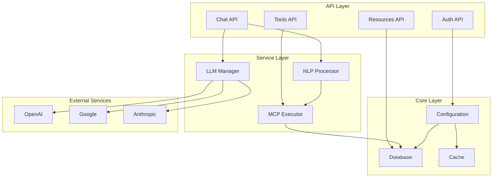

# MCP Hub Core - Development Guide

## Overview

This guide provides comprehensive information for developers working on MCP Hub Core, including setup, architecture, coding standards, testing, and contribution guidelines.

## Development Environment Setup

### Prerequisites

- Python 3.8+
- Git
- Virtual environment (venv, conda, or pipenv)
- Code editor (VS Code, PyCharm, etc.)
- API keys for LLM providers

### Initial Setup

```bash
# Clone repository
git clone https://github.com/Kibrom1/mcp_hub.git
cd mcp_hub/mcp-hub-core

# Create virtual environment
python -m venv venv
source venv/bin/activate  # On Windows: venv\Scripts\activate

# Install dependencies
pip install -r requirements.txt

# Install development dependencies
pip install -r requirements-dev.txt

# Set up pre-commit hooks
pre-commit install

# Copy environment template
cp env.example .env
# Edit .env with your configuration
```

### Development Dependencies

**requirements-dev.txt:**
```
# Testing
pytest==7.4.0
pytest-asyncio==0.21.1
pytest-cov==4.1.0
httpx==0.24.1

# Code Quality
black==23.7.0
flake8==6.0.0
mypy==1.5.1
isort==5.12.0

# Pre-commit
pre-commit==3.3.3

# Documentation
mkdocs==1.5.2
mkdocs-material==9.1.21
```

## Project Architecture

### Directory Structure

```
mcp-hub-core/
├── app/                          # Main application package
│   ├── __init__.py              # Package initialization
│   ├── api/                     # API endpoints
│   │   ├── __init__.py
│   │   ├── auth.py              # Authentication endpoints
│   │   ├── chat.py              # Chat and NLP endpoints
│   │   ├── resources.py         # Resource management endpoints
│   │   └── tools.py             # Tool execution endpoints
│   ├── core/                    # Core configuration
│   │   ├── __init__.py
│   │   ├── config.py            # Application configuration
│   │   └── database.py          # Database initialization
│   └── services/                # Business logic services
│       ├── llm_manager.py       # LLM provider management
│       ├── mcp_executor.py      # MCP tool execution
│       └── nlp_tool_processor.py # Natural language processing
├── tests/                       # Test suite
│   ├── __init__.py
│   ├── conftest.py             # Test configuration
│   ├── unit/                   # Unit tests
│   │   ├── test_api/
│   │   ├── test_services/
│   │   └── test_core/
│   ├── integration/            # Integration tests
│   └── fixtures/               # Test fixtures
├── docs/                       # Documentation
│   ├── BACKEND_ARCHITECTURE.md
│   ├── API_REFERENCE.md
│   ├── DEPLOYMENT_GUIDE.md
│   └── DEVELOPMENT_GUIDE.md
├── scripts/                    # Utility scripts
│   ├── setup_db.py
│   ├── migrate.py
│   └── test_api.py
├── main.py                     # FastAPI application entry point
├── requirements.txt            # Production dependencies
├── requirements-dev.txt        # Development dependencies
├── pyproject.toml             # Project configuration
├── .pre-commit-config.yaml    # Pre-commit hooks
├── .gitignore                 # Git ignore rules
└── README.md                  # Project documentation
```

### Component Architecture



## Coding Standards

### Python Style Guide

We follow PEP 8 with some modifications:

```python
# Use type hints for all functions
def process_message(message: str, provider: str = "openai") -> Dict[str, Any]:
    """Process a chat message with the specified provider.
    
    Args:
        message: The user's message
        provider: The LLM provider to use
        
    Returns:
        Dictionary containing the response and metadata
        
    Raises:
        ValueError: If provider is not supported
    """
    if provider not in SUPPORTED_PROVIDERS:
        raise ValueError(f"Unsupported provider: {provider}")
    
    # Implementation here
    return {"response": "processed", "provider": provider}
```

### Code Organization

#### 1. API Endpoints
```python
# app/api/chat.py
from fastapi import APIRouter, HTTPException, Depends
from pydantic import BaseModel
from typing import Dict, Any
from app.services.llm_manager import LLMManager
from app.services.nlp_tool_processor import NLPToolProcessor

router = APIRouter()

class ChatRequest(BaseModel):
    message: str
    provider: str = "openai"
    max_tokens: int = 2000
    temperature: float = 0.3

@router.post("/")
async def send_message(request: ChatRequest):
    """Send a chat message and get AI response."""
    try:
        # Implementation
        pass
    except Exception as e:
        raise HTTPException(status_code=500, detail=str(e))
```

#### 2. Service Classes
```python
# app/services/llm_manager.py
from abc import ABC, abstractmethod
from typing import List, Dict, Any
import asyncio

class LLMProvider(ABC):
    """Abstract base class for LLM providers."""
    
    @abstractmethod
    async def generate_response(self, messages: List[Dict], **kwargs) -> Dict[str, Any]:
        """Generate a response from the LLM."""
        pass

class LLMManager:
    """Manages multiple LLM providers with fallback logic."""
    
    def __init__(self):
        self.providers = {}
        self._initialize_providers()
    
    async def generate_response_async(self, messages: List[Dict], provider: str, **kwargs):
        """Generate response with fallback logic."""
        try:
            return await self.providers[provider].generate_response(messages, **kwargs)
        except Exception as e:
            # Fallback logic
            return await self._fallback_response(messages, provider, e)
```

#### 3. Configuration Management
```python
# app/core/config.py
from pydantic import BaseSettings, Field
from typing import Optional, List

class Settings(BaseSettings):
    """Application settings with validation."""
    
    # API Keys
    openai_api_key: Optional[str] = Field(None, env="OPENAI_API_KEY")
    google_api_key: Optional[str] = Field(None, env="GOOGLE_API_KEY")
    anthropic_api_key: Optional[str] = Field(None, env="ANTHROPIC_API_KEY")
    
    # Application
    cors_origins: List[str] = Field(
        default=["http://localhost:3000"], 
        env="CORS_ORIGINS"
    )
    database_url: str = Field(default="sqlite:///mcp.db", env="DATABASE_URL")
    log_level: str = Field(default="INFO", env="LOG_LEVEL")
    
    class Config:
        env_file = ".env"
        case_sensitive = False

settings = Settings()
```

### Error Handling

```python
# Custom exceptions
class MCPHubException(Exception):
    """Base exception for MCP Hub."""
    pass

class LLMProviderError(MCPHubException):
    """LLM provider specific errors."""
    pass

class ToolExecutionError(MCPHubException):
    """Tool execution errors."""
    pass

# Error handling decorator
def handle_errors(func):
    """Decorator for consistent error handling."""
    async def wrapper(*args, **kwargs):
        try:
            return await func(*args, **kwargs)
        except LLMProviderError as e:
            logger.error(f"LLM Provider Error: {e}")
            raise HTTPException(status_code=503, detail="LLM service unavailable")
        except ToolExecutionError as e:
            logger.error(f"Tool Execution Error: {e}")
            raise HTTPException(status_code=400, detail=f"Tool execution failed: {e}")
        except Exception as e:
            logger.error(f"Unexpected error: {e}")
            raise HTTPException(status_code=500, detail="Internal server error")
    return wrapper
```

## Testing

### Test Structure

```
tests/
├── conftest.py                 # Test configuration and fixtures
├── unit/                      # Unit tests
│   ├── test_api/
│   │   ├── test_auth.py
│   │   ├── test_chat.py
│   │   ├── test_resources.py
│   │   └── test_tools.py
│   ├── test_services/
│   │   ├── test_llm_manager.py
│   │   ├── test_mcp_executor.py
│   │   └── test_nlp_processor.py
│   └── test_core/
│       ├── test_config.py
│       └── test_database.py
├── integration/               # Integration tests
│   ├── test_api_integration.py
│   ├── test_llm_integration.py
│   └── test_database_integration.py
└── fixtures/                  # Test data and fixtures
    ├── sample_responses.json
    ├── test_data.sql
    └── mock_responses.py
```

### Unit Tests

```python
# tests/unit/test_services/test_llm_manager.py
import pytest
from unittest.mock import AsyncMock, patch
from app.services.llm_manager import LLMManager, LLMProviderError

class TestLLMManager:
    """Test cases for LLM Manager."""
    
    @pytest.fixture
    def llm_manager(self):
        """Create LLM manager instance for testing."""
        return LLMManager()
    
    @pytest.mark.asyncio
    async def test_generate_response_success(self, llm_manager):
        """Test successful response generation."""
        messages = [{"role": "user", "content": "Hello"}]
        
        with patch.object(llm_manager.providers['openai'], 'generate_response') as mock_generate:
            mock_generate.return_value = {"content": "Hello back!", "tokens_used": 10}
            
            result = await llm_manager.generate_response_async(
                messages, provider="openai"
            )
            
            assert result["content"] == "Hello back!"
            assert result["tokens_used"] == 10
    
    @pytest.mark.asyncio
    async def test_generate_response_fallback(self, llm_manager):
        """Test fallback when primary provider fails."""
        messages = [{"role": "user", "content": "Hello"}]
        
        with patch.object(llm_manager.providers['openai'], 'generate_response') as mock_openai:
            mock_openai.side_effect = LLMProviderError("Quota exceeded")
            
            with patch.object(llm_manager.providers['google'], 'generate_response') as mock_google:
                mock_google.return_value = {"content": "Hello from Google!", "tokens_used": 8}
                
                result = await llm_manager.generate_response_async(
                    messages, provider="openai"
                )
                
                assert result["content"] == "Hello from Google!"
                assert result["provider"] == "google"
```

### Integration Tests

```python
# tests/integration/test_api_integration.py
import pytest
from httpx import AsyncClient
from main import app

class TestAPIIntegration:
    """Integration tests for API endpoints."""
    
    @pytest.fixture
    async def client(self):
        """Create test client."""
        async with AsyncClient(app=app, base_url="http://test") as ac:
            yield ac
    
    @pytest.mark.asyncio
    async def test_chat_endpoint_integration(self, client):
        """Test complete chat flow."""
        response = await client.post("/api/chat/", json={
            "message": "List database tables",
            "provider": "openai"
        })
        
        assert response.status_code == 200
        data = response.json()
        assert "response" in data
        assert "provider" in data
        assert "timestamp" in data
    
    @pytest.mark.asyncio
    async def test_tool_execution_integration(self, client):
        """Test tool execution flow."""
        response = await client.post("/api/tools/query_database/execute", json={
            "query": "SELECT COUNT(*) FROM tools"
        })
        
        assert response.status_code == 200
        data = response.json()
        assert data["success"] is True
        assert "result" in data
```

### Test Configuration

```python
# tests/conftest.py
import pytest
import asyncio
from sqlalchemy import create_engine
from sqlalchemy.orm import sessionmaker
from app.core.database import get_db, Base
from main import app

@pytest.fixture(scope="session")
def event_loop():
    """Create an instance of the default event loop for the test session."""
    loop = asyncio.get_event_loop_policy().new_event_loop()
    yield loop
    loop.close()

@pytest.fixture
def test_db():
    """Create test database."""
    engine = create_engine("sqlite:///:memory:")
    Base.metadata.create_all(engine)
    TestingSessionLocal = sessionmaker(autocommit=False, autoflush=False, bind=engine)
    
    def override_get_db():
        try:
            db = TestingSessionLocal()
            yield db
        finally:
            db.close()
    
    app.dependency_overrides[get_db] = override_get_db
    yield TestingSessionLocal
    Base.metadata.drop_all(engine)

@pytest.fixture
def sample_tools():
    """Sample tools for testing."""
    return [
        {
            "name": "list_tables",
            "server": "sqlite",
            "description": "List all tables",
            "parameters": []
        },
        {
            "name": "query_database",
            "server": "sqlite",
            "description": "Execute SQL query",
            "parameters": [{"name": "query", "type": "string"}]
        }
    ]
```

### Running Tests

```bash
# Run all tests
pytest

# Run with coverage
pytest --cov=app --cov-report=html

# Run specific test file
pytest tests/unit/test_services/test_llm_manager.py

# Run with verbose output
pytest -v

# Run integration tests only
pytest tests/integration/
```

## Development Workflow

### Git Workflow

```bash
# Create feature branch
git checkout -b feature/new-llm-provider

# Make changes and commit
git add .
git commit -m "feat: add new LLM provider support"

# Push branch
git push origin feature/new-llm-provider

# Create pull request
# After review and approval, merge to main
```

### Code Quality Checks

```bash
# Format code
black app/ tests/

# Sort imports
isort app/ tests/

# Lint code
flake8 app/ tests/

# Type checking
mypy app/

# Run all checks
pre-commit run --all-files
```

### Pre-commit Configuration

```yaml
# .pre-commit-config.yaml
repos:
  - repo: https://github.com/psf/black
    rev: 23.7.0
    hooks:
      - id: black
        language_version: python3

  - repo: https://github.com/pycqa/isort
    rev: 5.12.0
    hooks:
      - id: isort

  - repo: https://github.com/pycqa/flake8
    rev: 6.0.0
    hooks:
      - id: flake8

  - repo: https://github.com/pre-commit/mirrors-mypy
    rev: v1.5.1
    hooks:
      - id: mypy
        additional_dependencies: [types-all]
```

## Adding New Features

### 1. Adding New LLM Provider

```python
# app/services/providers/new_provider.py
from app.services.llm_manager import LLMProvider
from typing import List, Dict, Any

class NewProvider(LLMProvider):
    """New LLM provider implementation."""
    
    def __init__(self, api_key: str):
        self.api_key = api_key
        self.client = self._initialize_client()
    
    async def generate_response(self, messages: List[Dict], **kwargs) -> Dict[str, Any]:
        """Generate response using new provider."""
        # Implementation here
        pass
    
    def _initialize_client(self):
        """Initialize provider client."""
        # Implementation here
        pass
```

### 2. Adding New Tool

```python
# app/services/mcp_executor.py
async def execute_new_tool(self, tool_name: str, arguments: Dict[str, Any]) -> Dict[str, Any]:
    """Execute new tool."""
    if tool_name == "new_tool":
        return await self._execute_new_tool(arguments)
    # ... existing tools

async def _execute_new_tool(self, arguments: Dict[str, Any]) -> Dict[str, Any]:
    """Execute the new tool logic."""
    try:
        # Tool implementation
        result = self._perform_new_operation(arguments)
        return {
            "server": "new_server",
            "tool": "new_tool",
            "result": result,
            "success": True
        }
    except Exception as e:
        return {
            "server": "new_server",
            "tool": "new_tool",
            "error": str(e),
            "success": False
        }
```

### 3. Adding New API Endpoint

```python
# app/api/new_endpoint.py
from fastapi import APIRouter, HTTPException
from pydantic import BaseModel
from typing import Dict, Any

router = APIRouter()

class NewRequest(BaseModel):
    param1: str
    param2: int

@router.post("/new-endpoint")
async def new_endpoint(request: NewRequest) -> Dict[str, Any]:
    """New endpoint implementation."""
    try:
        # Implementation here
        return {"result": "success"}
    except Exception as e:
        raise HTTPException(status_code=500, detail=str(e))
```

## Debugging

### Logging Configuration

```python
# app/core/logging.py
import logging
import sys
from typing import Dict, Any

def setup_logging(log_level: str = "INFO") -> None:
    """Configure application logging."""
    logging.basicConfig(
        level=getattr(logging, log_level.upper()),
        format="%(asctime)s - %(name)s - %(levelname)s - %(message)s",
        handlers=[
            logging.StreamHandler(sys.stdout),
            logging.FileHandler("mcp_hub.log")
        ]
    )

# Usage in services
logger = logging.getLogger(__name__)

class LLMManager:
    def __init__(self):
        logger.info("Initializing LLM Manager")
    
    async def generate_response_async(self, messages, provider):
        logger.debug(f"Generating response with provider: {provider}")
        try:
            result = await self._generate_response(messages, provider)
            logger.info(f"Response generated successfully: {len(result.get('content', ''))} chars")
            return result
        except Exception as e:
            logger.error(f"Error generating response: {e}")
            raise
```

### Debug Mode

```python
# main.py
import logging

if __name__ == "__main__":
    # Enable debug logging
    logging.basicConfig(level=logging.DEBUG)
    
    # Run with debug mode
    uvicorn.run(
        "main:app",
        host="0.0.0.0",
        port=8000,
        reload=True,
        log_level="debug"
    )
```

### Debugging Tools

```python
# Debug decorator
def debug_function(func):
    """Decorator to debug function calls."""
    import functools
    
    @functools.wraps(func)
    async def wrapper(*args, **kwargs):
        logger.debug(f"Calling {func.__name__} with args: {args}, kwargs: {kwargs}")
        try:
            result = await func(*args, **kwargs)
            logger.debug(f"{func.__name__} returned: {result}")
            return result
        except Exception as e:
            logger.error(f"{func.__name__} failed with error: {e}")
            raise
    return wrapper
```

## Performance Optimization

### Database Optimization

```python
# app/core/database.py
from sqlalchemy import create_engine, pool
from sqlalchemy.orm import sessionmaker

def create_engine_optimized(database_url: str):
    """Create optimized database engine."""
    return create_engine(
        database_url,
        poolclass=pool.QueuePool,
        pool_size=10,
        max_overflow=20,
        pool_pre_ping=True,
        pool_recycle=3600,
        echo=False  # Set to True for SQL debugging
    )
```

### Caching Implementation

```python
# app/core/cache.py
import redis
import json
from typing import Any, Optional
from functools import wraps

class CacheManager:
    """Redis-based caching manager."""
    
    def __init__(self, redis_url: str = "redis://localhost:6379"):
        self.redis_client = redis.from_url(redis_url)
    
    def cache_result(self, expiry: int = 300):
        """Decorator to cache function results."""
        def decorator(func):
            @wraps(func)
            async def wrapper(*args, **kwargs):
                cache_key = f"{func.__name__}:{hash(str(args) + str(kwargs))}"
                
                # Try to get from cache
                cached = self.redis_client.get(cache_key)
                if cached:
                    return json.loads(cached)
                
                # Execute function and cache result
                result = await func(*args, **kwargs)
                self.redis_client.setex(cache_key, expiry, json.dumps(result))
                return result
            return wrapper
        return decorator
```

## Documentation

### Code Documentation

```python
def complex_function(param1: str, param2: int, **kwargs) -> Dict[str, Any]:
    """Perform complex operation with detailed documentation.
    
    This function demonstrates proper documentation standards for complex
    operations that require detailed explanation.
    
    Args:
        param1: Description of the first parameter
        param2: Description of the second parameter
        **kwargs: Additional keyword arguments
            - option1: Description of option1
            - option2: Description of option2
    
    Returns:
        Dictionary containing:
            - result: The computed result
            - metadata: Additional information about the operation
            - success: Boolean indicating if operation succeeded
    
    Raises:
        ValueError: If param1 is empty or invalid
        RuntimeError: If the operation fails due to external factors
    
    Example:
        >>> result = complex_function("test", 42, option1="value")
        >>> print(result["success"])
        True
    
    Note:
        This function is thread-safe and can be called concurrently.
    """
    # Implementation here
    pass
```

### API Documentation

```python
# app/api/chat.py
@router.post("/", response_model=ChatResponse)
async def send_message(request: ChatRequest):
    """Send a chat message and get AI response.
    
    This endpoint processes natural language messages and returns AI-generated
    responses. It supports multiple LLM providers and includes natural language
    processing for tool execution.
    
    The endpoint will:
    1. Process the message for natural language tool commands
    2. Execute tools if high-confidence matches are found
    3. Fall back to LLM generation for general conversation
    4. Return formatted response with metadata
    
    Args:
        request: Chat request containing message and options
        
    Returns:
        ChatResponse with AI response and metadata
        
    Raises:
        HTTPException: If message processing fails
        
    Example:
        ```python
        response = requests.post("/api/chat/", json={
            "message": "List database tables",
            "provider": "openai"
        })
        ```
    """
    # Implementation here
    pass
```

## Contributing

### Pull Request Process

1. **Fork the repository**
2. **Create feature branch**: `git checkout -b feature/amazing-feature`
3. **Make changes** following coding standards
4. **Add tests** for new functionality
5. **Update documentation** if needed
6. **Run quality checks**: `pre-commit run --all-files`
7. **Commit changes**: `git commit -m "feat: add amazing feature"`
8. **Push to branch**: `git push origin feature/amazing-feature`
9. **Create Pull Request**

### Code Review Checklist

- [ ] Code follows style guidelines
- [ ] Tests are included and passing
- [ ] Documentation is updated
- [ ] No breaking changes without migration
- [ ] Performance impact considered
- [ ] Security implications reviewed
- [ ] Error handling is appropriate

### Issue Reporting

When reporting issues, include:

1. **Environment details**:
   - Python version
   - Operating system
   - Dependencies versions

2. **Steps to reproduce**:
   - Clear, numbered steps
   - Expected vs actual behavior

3. **Error details**:
   - Full error messages
   - Stack traces
   - Log files

4. **Additional context**:
   - Screenshots if applicable
   - Related issues
   - Workarounds if any

This comprehensive development guide provides everything needed for effective development on MCP Hub Core, from initial setup to advanced debugging and optimization techniques.
